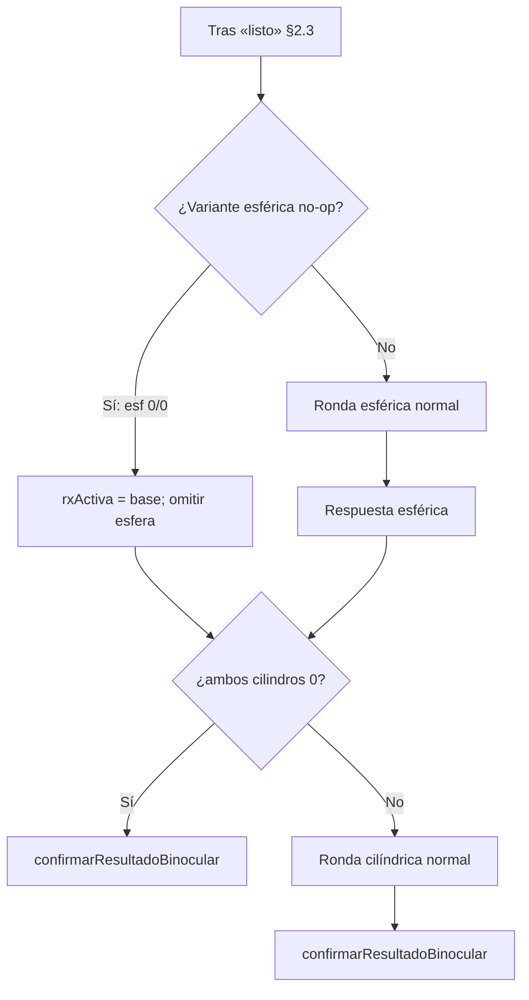
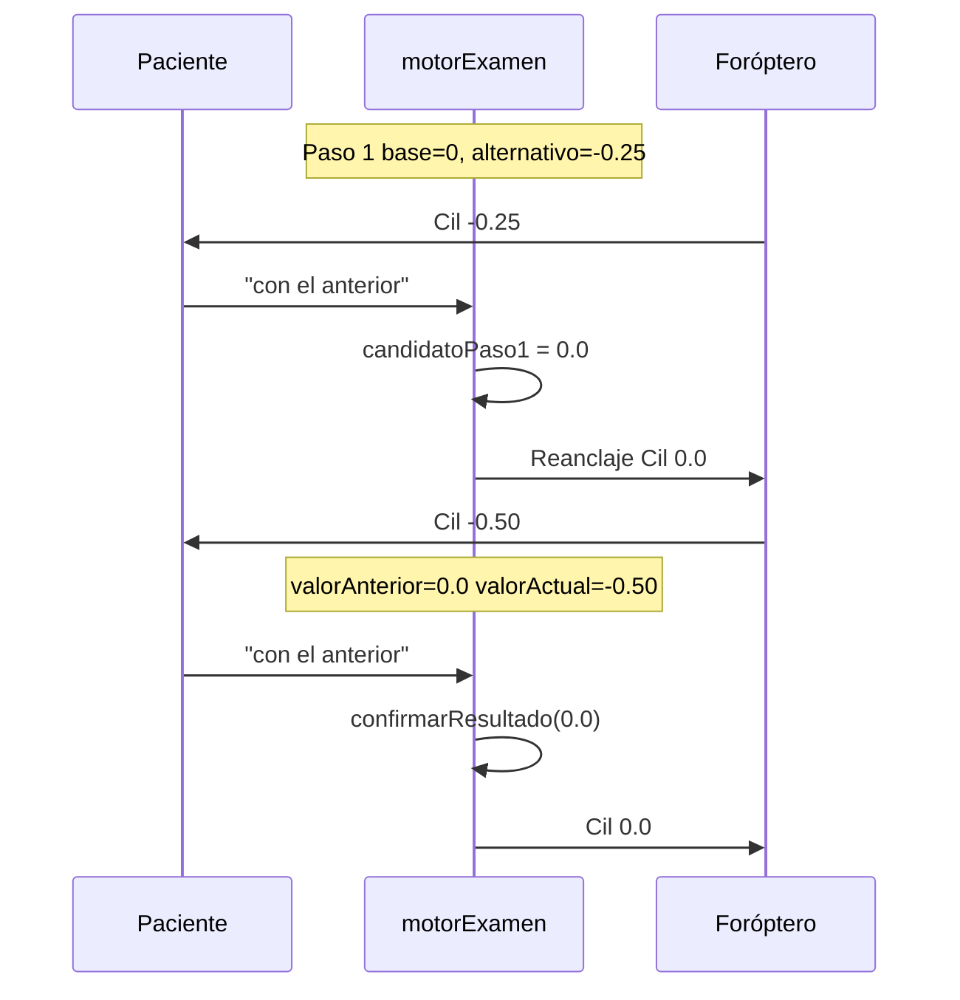

# Plan de implementación — Bugs binocular y cilíndrico (registro 13)

**Evidencia pre-fix:** `registros-examen/examen-registro-13.csv` (2026-07-03 10:15–10:29)  
**Evidencia post-fix B3:** `registros-examen/examen-registro-14.csv` (2026-07-03 11:01–11:15)  
**Evidencia post-fix B1:** `registros-examen/examen-registro-15.csv` (2026-07-03 11:48–12:02)  
**Evidencia pre-fix B4:** `registros-examen/examen-registro-15.csv` (l. 161–163 — ronda esférica no-op)  
**Estado:** **B1 y B3 implementados y QA OK** (`fe7d53f`, `a7ca9ad`) — **B2 y B4 pendientes**  
**Archivos principales afectados:** `reference/foroptero-server/motorExamen.js`  
**Referencias:** `DEFINICIONES_EXAMEN_BINOCULAR.md`, `PLAN_REANCLAJE_POST_COMPARATIVA_LENTES.md`, `PLAN_FEEDBACK_CLIENTE_EXAMEN.md` §2.6.3, §2.6.7, §4.0.6

---

## 0. Resumen ejecutivo

| # | Bug | Severidad | Causa raíz (1 línea) |
|---|-----|-----------|----------------------|
| **B1** | Al entrar en binocular, la Rx del foróptero **no** coincide con los resultados monoculars | Alta clínica | `construirRxBaseBinocular` / `cilYAnguloOjo` exige cilindro **y** ángulo confirmados; si falta ángulo (`pendiente`), descarta el cilindro monocular y usa `valoresRecalculados` | ✅ **Cerrado** (`fe7d53f`, registro-15 §9) |
| **B2** | Al decir «con la anterior» en la última prueba binocular, el examen finaliza pero el foróptero no refleja el resultado | Alta clínica | `confirmarResultadoBinocular` persiste resultados y avanza a `FINALIZADO` **sin** comando foróptero con la Rx elegida |
| **B3** | Cilíndrico secuencial bajo paso 2: «con la anterior» elige −0,25 en vez de 0,0 | Alta clínica | Tras paso 1, `obtenerInstrucciones` asigna `valorAnterior = valorActual` (−0,25) en lugar de `candidatoPaso1` (0,0) | ✅ **Cerrado** (`a7ca9ad`, registro-14 §8) |
| **B4** | Ronda binocular esférica o cilíndrica **sin contraste** (variante = base) igual se pregunta al paciente | Media UX / protocolo | Tras «listo», el motor siempre entra en `FB_ESF_MOSTRAR` aunque `aplicarVarianteEsferica` no cambie ningún ojo; §7 cilíndrico solo omite **después** de cerrar esfera | Pendiente |

**Registro-13 (pre-fix):** `Cilíndrico (R) = −0,25` (línea 176) — paciente eligió 0,0 en paso 2 pero el motor confirmó −0,25.  
**Registro-14 (post-fix):** `Cilíndrico (R) = 0` (línea 180) — mismo protocolo, resultado correcto.  
**Registro-15 (pre-fix B4):** esférico fino 0/0 → ronda esférica binocular innecesaria (l. 161–163) antes de la cilíndrica útil (l. 164).

---

## 1. Análisis del registro — evidencia por bug

### Contexto del examen

| Campo | Valor |
|-------|-------|
| Valores iniciales | `<R> +0.25, -0.50, 175 / <L> +0.50, -1.50, 20` |
| Valores recalculados | `<R> +0.25, +0.00, 175 / <L> +0.50, -1.00, 20` |
| Resultado OD cilíndrico | **−0,25** (incorrecto si la intención clínica era 0,0) |
| Resultado binocular | `R: Esf +0.00 / Cil +0.00 @ 0° / L: Esf +0.00 / Cil −0.50 @ 20°` |

---

### B1 — Rx binocular de entrada ≠ resultados monoculars (monocular → binocular)

**Síntoma:** Al abrir ambas oclusiones e iniciar ETAPA_6, el foróptero muestra una Rx que **no** refleja lo confirmado en los tests monoculars por ojo — en particular el **cilindro** de OI.

**Regla de negocio (DEFINICIONES §2.1):** la línea base binocular debe usar esférico fino confirmado por ojo y, para cilindro/eje, los resultados del test cilíndrico (y ángulo si hubo test de ángulo); solo si **no** hubo test cilíndrico, usar `valoresRecalculados`.

**Evidencia principal — registro-14:**

Resultados monoculars al cierre (CSV resumen):

| Ojo | Esférico fino | Cilíndrico | Cilíndrico ángulo |
|-----|---------------|------------|-------------------|
| R | 0 | 0 | pendiente |
| L | 0 | **−0,50** | pendiente |

Inmediatamente antes, agudeza OI monocular (l. 140–155): foróptero con `L Cil −0.50` de forma consistente.

**Salto monocular → binocular (l. 160):**

```
<R> Esf +0.00 / Cil +0.00 / (open); <L> Esf +0.00 / Cil -1.00 / @20° / (open)
```

| Ojo | Esperado (resultados monoculars + recalc solo para ángulo) | Observado l. 160 |
|-----|--------------------------------------------------------------|------------------|
| R | Esf 0, Cil 0, @175° recalc | Esf 0, Cil 0 ✓ |
| L | Esf 0, Cil **−0,50**, @20° recalc | Esf 0, Cil **−1,00** ✗ |

El **−1,00** coincide con `valoresRecalculados` del autorefractómetro, **no** con `Cilíndrico (L) = −0,50`.

**Misma discrepancia en registro-13 (l. 156):** `L Cil −1.00` al entrar en binocular pese a resultado cilíndrico OI **−0,50**.

**Efecto clínico:** el paciente termina agudeza monocular con un cilindro, abre ambos ojos y el dispositivo **salta** a otro cilindro antes de la fase «listo». La adaptación binocular arranca sobre una Rx incorrecta; las comparativas siguientes (p. ej. variante cilíndrica −1,00 → −0,50 en registro-14 l. 171) parten de una base errada.

**Nota:** síntomas colaterales (pregunta esférica no-op tras «listo», texto «otro par» sin cambio) eran confusión de UX; quedaron acotados como **B4** (no eran el objeto de B1). Con base binocular correcta (B1), B4 elimina la ronda vacía.

---

### B4 — Comparativa binocular sin contraste (paso esférico o cilíndrico no-op)

**Síntoma:** Tras la fase «listo», el paciente recibe la pregunta «¿anterior o actual?» aunque la **variante del paso no movió ningún lente** en ningún ojo. No hay comparación clínica posible.

**Regla de producto:** si la variante de un paso binocular es **idéntica** a su base (no-op global), **omitir** ese paso completo — sin pregunta, sin `interpretacionComparacion` — y continuar al siguiente paso aplicable o confirmar resultado.

**Evidencia principal — registro-15 (post-fix B1):**

Base binocular tras agudeza OI (l. 155, 159):

```
<R> Esf +0.00 / Cil +0.00;  <L> Esf +0.00 / Cil -0.50 @20°
```

| Línea | Evento | ¿Hay cambio de lente? |
|-------|--------|------------------------|
| 161–162 | 1.ª pregunta comparativa (paso **esférico**) | **No** — entre l. 159 y l. 164 no hay línea Foróptero con cambio de esfera |
| 163 | Paciente «con la actual» | Respuesta sin contraste físico previo |
| 164 | Variante **cilíndrica** | **Sí** — `L Cil −0.50 → 0.00` |
| 166–168 | 2.ª pregunta (cilíndrica) | Comparación válida |

**Condiciones de omisión (simétricas a DEFINICIONES §5):**

| Paso | Omitir si… | Equivalente en código |
|------|------------|------------------------|
| **Esfera** | `R.esfera === 0` **y** `L.esfera === 0` | `aplicarVarianteEsferica(rx)` === `rx` (normalizado) |
| **Cilindro** | `R.cilindro === 0` **y** `L.cilindro === 0` | `aplicarVarianteCilindrica(rx)` === `rx`; **parcialmente** implementado hoy solo **después** de responder esfera (§7) |

**Casos compuestos tras «listo»:**

| Esf R/L | Cil R/L | Rondas esperadas post-fix B4 |
|---------|---------|------------------------------|
| 0 / 0 | 0 / −0,50 | **Solo cilíndrica** (registro-15) |
| 0 / 0 | 0 / 0 | **Ninguna** → confirmar base |
| +0,25 / 0 | 0 / −0,50 | Esférica (solo R) + cilíndrica |
| ≠0 en algún ojo | 0 / 0 | Esférica + confirmar (sin cil.) — ya cubierto por §7 |

**Alcance estricto:** cambios **solo** en flujo ETAPA_6 / `testActual.tipo === 'binocular'`. **No** modificar ETAPA_5 (esférico/cilíndrico monocular), `comparacionParametroEsNoOp`, agudeza, ni modos `testesf` / `testcil`.

**Especificación parcial existente:** `DEFINICIONES_EXAMEN_BINOCULAR.md` §7 cubre omisión cilíndrica post-esfera; **falta** omisión esférica pre-comparativa y formulación unificada de «paso sin contraste».

---

### B2 — Binocular final «con la anterior»: resultado guardado pero foróptero no se mueve

**Síntoma:** Al cerrar la última comparación binocular con preferencia «anterior», el examen pasa a `FINALIZADO` pero el hardware sigue mostrando la **variante** que tenía el paciente en cara, no la Rx confirmada.

**Evidencia en registro-13:**

El registro-13 cierra la última ronda binocular con **«con la actual»** (líneas 170–171), por lo que foróptero y resultado coinciden (`L Cil −0.50`). **B2 no se manifiesta en este CSV concreto**, pero es reproducible por diseño cuando la última respuesta es «anterior»:

| Escenario | Rx en cara al responder | Rx confirmada (`rxActiva`) | Foróptero post-confirmación |
|-----------|-------------------------|----------------------------|-----------------------------|
| Última ronda, «con la **actual**» | `rxVariante` (ej. L −0,50) | `rxVariante` | ✅ Coincide (caso registro-13) |
| Última ronda, «con la **anterior**» | `rxVariante` (ej. L −0,50) | `rxBasePaso` (ej. L −1,00 si **B1** sin fix) | ❌ Sigue en −0,50 |

**Contraste con ETAPA_5:** `confirmarResultado` para `cilindrico` **sí** llama a `ejecutarComandoForopteroInterno` con el valor final (aprox. líneas 3357–3378 de `motorExamen.js`). `confirmarResultadoBinocular` **no** tiene equivalente.

**Evidencia indirecta en registro-13:**

| Timestamp | Línea | Evento |
|-----------|-------|--------|
| 10:28:36 | 170–171 | «con la actual» → examen termina |
| 10:28:36 | 172–185 | `etapa_actual = FINALIZADO`; último foróptero = variante L −0,50 |
| — | 185 | Resultado binocular L Cil −0,50 — coherente solo porque la respuesta fue «actual» |

---

### B3 — Cilíndrico secuencial bajo paso 2: «anterior» → −0,25 en vez de 0,0

**Síntoma:** En la segunda comparativa del modo `cilindricoSecuencialBajo` (par **C1 vs −0,50**), si el paciente elige «con la anterior» (esperando C1 = 0,0), el sistema confirma −0,25.

**Evidencia en registro-13 (OD, base cilíndrica 0,0 tras esférico fino):**

| Timestamp | Línea | Foróptero (OD) | Respuesta | Interpretación |
|-----------|-------|----------------|-----------|----------------|
| 10:18:08 | 48 | `Esf +0.00 / Cil +0.00` | Fin esférico fino | Base cilíndrico = 0 |
| 10:18:20 | 50 | `Cil −0.25` | — | **Paso 1:** 0 vs −0,25 (alternativo) |
| 10:18:41 | 53–55 | `Cil +0.00` | «con el anterior» | C1 = **0,0**; reanclaje correcto en hardware |
| 10:18:51 | 57 | `Cil −0.50` | — | **Paso 2:** debería ser 0,0 vs −0,50 |
| 10:19:02 | 60–62 | `Cil −0.25` | «con el anterior» | ❌ Fue a −0,25, no a 0,0 |
| — | 176 | Resultado `Cilíndrico (R) = −0.25` | — | Confirma el bug |

**Reconstrucción del estado interno erróneo en paso 2:**

```
Tras paso 1 («anterior» → C1 = 0,0):
  candidatoPaso1 = 0,0
  valorElegidoReanclaje = 0,0
  valorAMostrar (paso 2) = −0,50

obtenerInstrucciones (líneas 2030–2032) hace:
  caraAntesUpdate = valorActual = −0,25   ← lo que estaba en cara en paso 1
  valorAnterior   = valorActual = −0,25   ← BUG: debería ser candidatoPaso1 = 0,0
  valorActual     = −0,50

Al responder «anterior» en paso 2:
  elegirCandidato() → snapOtro = valorAnterior = −0,25   ← incorrecto
  confirmarResultado(−0,25)
```

**Lo que el foróptero hizo bien vs. lo que falló:**

| Capa | Paso 1 → 2 | Paso 2 respuesta |
|------|------------|------------------|
| **Hardware** | Reanclaje a Cil 0,0 (l. 55) → muestra −0,50 (l. 57) | Vuelve a −0,25 (l. 62) siguiendo lógica errónea |
| **Estado lógico** | `valorAnterior` no se actualiza a C1 | `snapOtro` = −0,25 en lugar de 0,0 |

**Especificación violada:** `PLAN_FEEDBACK_CLIENTE_EXAMEN.md` §2.6.3.2 — *«Inicio paso 2: comparativa C1 (referencia / valorAnterior) vs −0,50»*.

---

## 2. Causa raíz en código

### B1 — `construirRxBaseBinocular`: cilindro/ángulo «todo o nada»

**Ubicación:** `motorExamen.js` — `construirRxBaseBinocular()` (~3583), helper interno `cilYAnguloOjo()` (~3608).

**Lógica actual (incorrecta):**

```javascript
if (tieneCil && tieneAng) {
  return { cilindro: res.cilindrico, angulo: res.cilindricoAngulo };
}
return { cilindro: recalc[ojo].cilindro, angulo: recalc[ojo].angulo };
```

Si `cilindricoAngulo` es `null` (`pendiente` — test de ángulo no implementado en secuencia normal), **descarta también** `cilindrico` confirmado y sustituye **ambos** campos por autorefractómetro.

**Lógica correcta (ya existe en el mismo archivo):** `calcularValoresFinalesForoptero()` (~889) resuelve **campo por campo**:

| Campo | Prioridad |
|-------|-----------|
| Esfera | `esfericoFino` → `esfericoGrueso` → recalc |
| Cilindro | `cilindrico` → recalc |
| Ángulo | `cilindricoAngulo` → recalc |

Por eso agudeza monocular OI en registro-14 muestra **Cil −0,50** y la entrada binocular muestra **−1,00**: dos funciones distintas arman la misma Rx.

**Caso R en registro-14 (no se nota el bug):** `cilindrico R = 0` y recalc `0` → el fallback da el mismo valor; enmascara el error en OD.

**Cadena causal:**

```
agudeza_alcanzada (L) termina → test binocular
→ iniciarBinocular() → construirRxBaseBinocular()
→ cilYAnguloOjo('L'): tieneCil=true (−0.5), tieneAng=false (pendiente)
→ fallback completo → L cilindro = recalc −1.00
→ foropteroDesdeRx en FB_TRANS_LISTO (l. 160 registro-14)
```

**Especificación violada:** `DEFINICIONES_EXAMEN_BINOCULAR.md` §2.1 — usar resultado cilíndrico cuando el test se ejecutó; ángulo de recalc si no hubo test de ángulo.

---

### B2 — Binocular: confirmación sin movimiento de foróptero

**Ubicación:** `motorExamen.js`

| Función | Problema |
|---------|----------|
| `confirmarResultadoBinocular()` (~3887–3905) | Escribe `resultados.R/L.binocular`, resetea estado, `avanzarTest()` — **sin** `foropteroDesdeRx` ni `ejecutarComandoForopteroInterno` |
| `obtenerInstrucciones()` ETAPA_6 (~2137–2152) | Tras `resultadoConfirmado`, llama `generarPasos()` → etapa `FINALIZADO` (sin pasos de hardware) |

**Cadena causal (última ronda, preferencia «anterior»):**

```
procesarRespuestaBinocular (paso cilindro, anterior)
→ rxActiva = rxBasePaso (ej. L −1,00)
→ confirmarResultadoBinocular(rxActiva)  // persiste −1,00
→ foróptero sigue en rxVariante (L −0,50) mostrada durante la pregunta
→ avanzarTest() → FINALIZADO sin corrección
```

**Contraste:** `confirmarResultado()` para cilíndrico monocular sí actualiza foróptero de forma asíncrona (~3359–3378).

---

### B3 — Cilíndrico secuencial bajo: `valorAnterior` incorrecto al entrar en paso 2

**Ubicación:** `motorExamen.js` — bloque genérico ETAPA_5 `necesitaMostrarLente` (~2026–2033)

```javascript
const caraAntesUpdate = estado.valorActual;
estado.valorAnterior = estado.valorActual;  // ← BUG para paso 2 secuencial bajo
estado.valorActual = resultado.valorAMostrar;
```

**Problema:** La regla genérica asume que «anterior» en la siguiente comparativa es lo que estaba en cara (`valorActual`). En `cilindricoSecuencialBajo` paso 2, la referencia es **`candidatoPaso1`** (o `valorElegidoReanclaje`), no el alternativo del paso 1.

**Función afectada downstream:** `procesarRespuestaCilindricoSecuencialBajo()` (~3119–3124) usa `snapOtro = estado.valorAnterior` en `elegirCandidato()`.

**Por qué el reanclaje hardware no salva la lógica:** `valorElegidoReanclaje` se usa solo para `pasosReanchor` (foróptero), pero **no** para actualizar `valorAnterior` en el estado de comparación.

---

### B4 — Binocular: paso esférico no-op no se omite antes de preguntar

**Ubicación:** `motorExamen.js` — bloque ETAPA_6 únicamente (~3497–3890)

| Función | Comportamiento actual | Gap B4 |
|---------|----------------------|--------|
| `procesarRespuestaBinocular()` (~3832–3835) | Tras «listo» → siempre `FB_ESF_MOSTRAR` | No evalúa si variante esférica = base |
| `generarPasosEtapa6()` `FB_ESF_MOSTRAR` (~3768–3777) | Aplica `rxVariante` + pregunta §11 | Si esfera 0/0, variante = base → pregunta vacía |
| `procesarRespuestaBinocular()` paso esfera (~3873–3876) | Si `ambosCilindrosCero` → confirmar | §7 cilíndrico **sí**; pero solo **después** de que el paciente respondió esfera |
| `aplicarVarianteEsferica()` (~3636) | No mueve ojos con esfera 0 | Correcto; el bug es no **saltar** el paso |

**Cadena causal (registro-15):**

```
«listo» → faseBinocular = FB_ESF_MOSTRAR
→ rxVariante = aplicarVarianteEsferica(rxBase)  // idéntica a rxBase (0/0)
→ foróptero + MSG_BINOC_PREGUNTA_COMBINADA      // pregunta sin contraste
→ paciente responde → recién entonces paso cilindro
```

**Fuera de alcance (no tocar):**

- `comparacionParametroEsNoOp()` — monocular ETAPA_5
- `necesitaRitualSigamosPostComparacionLentes()` — intra-test monocular
- `generarPasosEtapa4/5`, `confirmarResultado()` cilíndrico monocular
- `iniciarBinocular()` / `construirRxBaseBinocular()` — sin cambio semántico de base

---

## 3. Plan de implementación

### Orden sugerido

| Orden | Bug | Motivo |
|-------|-----|--------|
| 1 | **B3** | Fix acotado, alta certeza, evidencia directa en registro-13 |
| 2 | **B1** | Fix acotado, paridad con `calcularValoresFinalesForoptero`; desbloquea base binocular correcta |
| 3 | **B2** | Fix acotado, paridad con `confirmarResultado` ETAPA_5 |
| 4 | **B4** | Mejora UX ETAPA_6; independiente de B2; evidencia registro-15; sin impacto monocular |

---

### Fase 1 — B3: `valorAnterior` en cilíndrico secuencial bajo paso 2 ✅ CERRADO

**Archivo:** `reference/foroptero-server/motorExamen.js`  
**Commit:** `a7ca9ad` — `fix(cilindrico): use C1 as reference in secuencial bajo step 2.`

**Tarea 1.1 — Corregir actualización de estado al pasar a paso 2** ✅

En el bloque `if (resultado.necesitaMostrarLente)` de ETAPA_5 (~2031), rama:

```javascript
if (estado.cilindricoSecuencialBajo && estado.pasoSecuencialBajo === 2) {
  estado.valorAnterior = estado.candidatoPaso1;
} else {
  estado.valorAnterior = estado.valorActual;
}
```

**Tarea 1.2 — Test / QA manual** ✅

| Caso | Base | Paso 1 | Paso 2 | Respuesta paso 2 | Resultado esperado | Registro-14 |
|------|------|--------|--------|------------------|-------------------|-------------|
| A | 0 | «anterior» (→ 0) | 0 vs −0,50 | «anterior» | Cil = **0,0** | ✅ l. 59–61, 180 |

**Evidencia:** `registros-examen/examen-registro-14.csv` — ver §8.

**Riesgo de regresión:** Bajo — cambio acotado a rama `cilindricoSecuencialBajo` paso 2; cilíndrico bilateral normal no usa este path. Smoke OI cilíndrico (−1,00 → −0,50) sin regresión en el mismo registro (l. 125–135, 186).

---

### Fase 2 — B2: foróptero al confirmar binocular

**Archivo:** `reference/foroptero-server/motorExamen.js`

**Tarea 2.1 — Aplicar Rx final en `confirmarResultadoBinocular`**

Opción recomendada (paridad ETAPA_5):

```
function confirmarResultadoBinocular(rxFinal) {
  const n = normalizarRxPar(copiarRxPar(rxFinal));
  // ... persistir resultados ...
  if (ejecutarComandoForopteroInterno) {
    await/ejecutar foropteroDesdeRx(n)  // ambos ojos open
  }
  // ... avanzarTest ...
}
```

Considerar `esperar_foroptero` si el contrato del examen requiere ready antes de `FINALIZADO` (evaluar vs. patrón async de cilíndrico monocular).

**Tarea 2.2 — Caso preferencia «anterior» en última ronda**

Tras fix, al responder «anterior» en `FB_CIL_PREG`:

1. `rxActiva = rxBasePaso`
2. Foróptero se mueve a `rxBasePaso`
3. Resultado CSV = `rxBasePaso`

**Tarea 2.3 — QA manual**

| Caso | Última respuesta | Foróptero post-examen | `resultados.*.binocular` |
|------|------------------|----------------------|--------------------------|
| A | «con la actual» | = variante | = variante |
| B | «con la anterior» | = base del paso cilíndrico | = base del paso cilíndrico |
| C | «igual» (→ anterior) | = base | = base |

**Evidencia:** CSV con caso B explícito (registro-13 no lo cubre; hay que forzar respuesta «anterior» en ronda cilíndrica final).

---

### Fase 3 — B1: alinear Rx de entrada binocular con resultados monoculars

**Archivos:** `reference/foroptero-server/motorExamen.js`, `DEFINICIONES_EXAMEN_BINOCULAR.md` (aclaración §2.1), `DOCUMENTACION.md` (ETAPA_6).

**Decisión de producto (D-B1) — cerrada:**

| Tema | Decisión |
|------|----------|
| Cilindro confirmado + ángulo pendiente | Usar **`cilindrico`** del resultado monocular; **`angulo`** de `valoresRecalculados` (misma regla que `calcularValoresFinalesForoptero`) |
| Esfera | Sin cambio: siempre `esfericoFino` confirmado (ya correcto en `construirRxBaseBinocular`) |
| Test cilíndrico no ejecutado | Cilindro y ángulo de recalc (sin cambio semántico) |
| Test cilíndrico **y** ángulo confirmados | Ambos de resultados (sin cambio) |

**Tarea 3.1 — Refactor `cilYAnguloOjo` (o reutilizar helper compartido)**

Opción mínima — reemplazar el bloque «todo o nada» por resolución por campo:

```javascript
const cilindro =
  res.cilindrico !== null && res.cilindrico !== undefined
    ? res.cilindrico
    : recalc[ojo].cilindro;
const angulo =
  res.cilindricoAngulo !== null && res.cilindricoAngulo !== undefined
    ? res.cilindricoAngulo
    : recalc[ojo].angulo;
return { cilindro, angulo };
```

Opción preferida — extraer helper compartido (p. ej. `resolverCilindroYAnguloOjo(ojo)`) usado por **`construirRxBaseBinocular`** y **`calcularValoresFinalesForoptero`** para una sola fuente de verdad.

**Tarea 3.2 — Documentación**

- Aclarar en `DEFINICIONES_EXAMEN_BINOCULAR.md` §2.1 que cilindro y ángulo se resuelven **independientemente** (cilindro del test si existe; ángulo del test de ángulo si existe, si no recalc).
- Actualizar `DOCUMENTACION.md` ETAPA_6 con la misma regla.

**Tarea 3.3 — QA manual**

Reproducir escenario registro-14 (cilíndrico OI −0,50, ángulo pendiente):

| # | Verificación | Evidencia esperada en CSV |
|---|--------------|---------------------------|
| 1 | Tras última línea agudeza OI monocular | `L Cil −0.50` |
| 2 | Primera línea binocular (ambos ojos open) | **Misma** Rx L: `Cil −0.50` (no −1,00) |
| 3 | Fase «listo» | Sin cambio de cilindro respecto a l. 2 |
| 4 | Variante cilíndrica binocular | Parte de **−0,50** → **0,00** (no de −1,00 → −0,50) |

**Caso borde R:** cilindro 0 + ángulo pendiente → debe seguir en Cil 0 (regresión).

**Caso borde futuro:** si se activa `cilindrico_angulo`, ambos campos desde resultados.

**Evidencia objetivo:** exportar `examen-registro-15.csv` (o equivalente) archivado en `registros-examen/`.

**Riesgo de regresión:** Bajo — alinea binocular con comportamiento ya validado en agudeza y ETAPA_5; modo `testbin` no usa `cilYAnguloOjo` (solo recalc).

---

### Fase 4 — B4: omitir pasos binocular sin contraste (solo ETAPA_6)

**Alcance:** únicamente `reference/foroptero-server/motorExamen.js` (funciones ETAPA_6) y `DEFINICIONES_EXAMEN_BINOCULAR.md`. **Sin** cambios en agente, firmware, ETAPA_1–5, ni helpers monocular compartidos salvo lectura.

**Decisión de producto (D-B4) — a cerrar en implementación:**

| Tema | Decisión |
|------|----------|
| Criterio no-op esférico | Omitir paso si **ambas** esferas normalizadas son **0** (DEFINICIONES §5) |
| Criterio no-op cilíndrico | Omitir paso si **ambos** cilindros son **0** (`ambosCilindrosCero`) — alinear §7 con salto **antes** de mostrar variante, no solo post-respuesta esfera |
| Auto-avance | Sin pregunta al paciente: `rxActiva = rxBasePaso` del paso omitido; actualizar `paso` / `faseBinocular` internamente |
| Esfera omitida + cil ≠ 0 | Ir directo a `FB_CIL_MOSTRAR` con base = línea post-«listo» |
| Esfera y cil omitidos | `confirmarResultadoBinocular(rxBase)` tras «listo» |
| Ritual reanclaje §4.3 | **No aplica** en paso omitido (no hubo comparación esférica) |
| Modo `testbin` | Misma regla no-op en ETAPA_6 (solo afecta binocular) |
| Trazabilidad | Opcional: `binocularEstado.omitirEsfera = true` / `omitirCilindro = true` para CSV/debug |

#### Definiciones — cambios en `DEFINICIONES_EXAMEN_BINOCULAR.md`

| Sección | Cambio |
|---------|--------|
| **§1 Objetivo** | Pasar de «dos pasos» fijos a «**hasta dos** pasos secuenciales (esférico y/o cilíndrico), omitiendo cualquier paso cuya variante no produzca cambio en ningún ojo». |
| **§7 (renumerar)** | Renombrar título a **«Omisión de pasos sin contraste»** (o dividir en §7 esférico + §8 cilíndrico y renumerar el resto). |
| **§7.1 Omisión esférica (nuevo)** | Tras confirmación «listo» (§2.3), si ambas esferas son 0: no ejecutar comparación esférica; `rxActiva` = base binocular; continuar evaluación cilíndrica o finalizar. |
| **§7.2 Omisión cilíndrica** | Mantener regla actual (ambos cil 0) pero aclarar que aplica **también** al evaluar el paso cilíndrico tras omitir esfera — sin exigir respuesta esférica previa. |
| **§12.2** | Añadir rama: «Si el paso es no-op según §7, saltar pasos 1–5 de la comparación y continuar flujo». |
| **§11 (nota)** | El mensaje combinado §11 **no** se emite en pasos omitidos. |

#### Código — cambios en `motorExamen.js` (solo ETAPA_6)

**Tarea 4.1 — Helpers locales** (junto a `aplicarVarianteEsferica`, ~3636; no exportar)

```javascript
function ambasEsferasCero(rx) {
  const n = normalizarRxPar(rx);
  return n.R.esfera === 0 && n.L.esfera === 0;
}

/** true si la variante del paso no altera ningún ojo (post-normalizar). */
function varianteBinocularEsNoOp(rxBase, paso /* 'esfera' | 'cilindro' */) {
  const base = normalizarRxPar(copiarRxPar(rxBase));
  const variant =
    paso === 'esfera'
      ? aplicarVarianteEsferica(base)
      : aplicarVarianteCilindrica(base);
  return (
    lensValorCerca(base.R.esfera, variant.R.esfera) &&
    lensValorCerca(base.R.cilindro, variant.R.cilindro) &&
    base.R.angulo === variant.R.angulo &&
    lensValorCerca(base.L.esfera, variant.L.esfera) &&
    lensValorCerca(base.L.cilindro, variant.L.cilindro) &&
    base.L.angulo === variant.L.angulo
  );
}
```

Alternativa mínima: `ambasEsferasCero(rx)` para esfera; reutilizar `ambosCilindrosCero(rx)` para cilindro (equivalente a no-op cilíndrico).

**Tarea 4.2 — Función de avance interno** (~nueva, solo llamada desde ETAPA_6)

```javascript
/**
 * Tras omitir paso esférico o tras «listo», decide siguiente fase binocular.
 * @returns {{ accion: 'mostrar_cil' | 'confirmar', rxActiva }}
 */
function avanzarBinocularTrasEsferaOmitida(estado) {
  estado.rxActiva = copiarRxPar(estado.rxBasePaso);
  if (ambosCilindrosCero(estado.rxActiva)) {
    return { accion: 'confirmar', rxActiva: estado.rxActiva };
  }
  estado.rxBasePaso = copiarRxPar(estado.rxActiva);
  estado.rxVariante = aplicarVarianteCilindrica(estado.rxBasePaso);
  estado.paso = 'cilindro';
  estado.faseBinocular = FB_CIL_MOSTRAR;
  return { accion: 'mostrar_cil', rxActiva: estado.rxActiva };
}
```

**Tarea 4.3 — Punto de enganche tras «listo»** — `procesarRespuestaBinocular()` (~3832)

Reemplazar salto directo a `FB_ESF_MOSTRAR` por:

```javascript
if (esRespuestaContinuidadBinocular(respuestaPaciente)) {
  if (varianteBinocularEsNoOp(estado.rxBasePaso, 'esfera')) {
    estado.omitirEsfera = true; // opcional debug
    const next = avanzarBinocularTrasEsferaOmitida(estado);
    if (next.accion === 'confirmar') {
      return confirmarResultadoBinocular(next.rxActiva);
    }
    return { ok: true, necesitaMostrarLente: true };
  }
  estado.faseBinocular = FB_ESF_MOSTRAR;
  return { ok: true, necesitaMostrarLente: true };
}
```

**Tarea 4.4 — Refactor §7 cilíndrico existente** — `procesarRespuestaBinocular()` paso esfera (~3873)

Extraer la rama `ambosCilindrosCero` → confirmar a helper compartido con 4.2 para una sola fuente de verdad. Opcional: al **iniciar** `FB_CIL_MOSTRAR`, si `varianteBinocularEsNoOp(rxBasePaso, 'cilindro')` → confirmar (defensa en profundidad; hoy redundante si `ambosCilindrosCero`).

**Tarea 4.5 — Documentación**

- `DEFINICIONES_EXAMEN_BINOCULAR.md` — §1, §7, §12 según tabla anterior.
- `DOCUMENTACION.md` ETAPA_6 — una línea: pasos omitidos si variante no-op.
- **No** modificar `PLAN_REANCLAJE` (ritual aplica solo tras comparación esférica **real**).

**Tarea 4.6 — QA manual**

Reproducir registro-15 (esf 0/0, L cil −0,50):

| # | Verificación | Evidencia CSV esperada |
|---|--------------|------------------------|
| 1 | Tras «listo», **sin** pregunta esférica §11 | Entre l. «listo» y primera pregunta, **un solo** cambio Foróptero: `L Cil −0.50 → 0.00` |
| 2 | Una sola comparativa con contraste | Una respuesta `interpretacionComparacion` antes del cambio cilíndrico |
| 3 | Esf 0/0, Cil 0/0 | Tras «listo», FINALIZADO **sin** comparativas |
| 4 | R esf +0,25, L 0 | Ronda esférica **sí** (solo R se mueve) — regresión |
| 5 | Examen monocular completo | Sin cambio de conteo de comparativas ETAPA_5 |

**Evidencia objetivo:** `registros-examen/examen-registro-16.csv` (o siguiente).

**Riesgo de regresión:** Bajo si el diff queda acotado a `procesarRespuestaBinocular`, `generarPasosEtapa6` y helpers en el bloque ETAPA_6; **cero** edits en ramas `estadoExamen.etapa !== 'ETAPA_6'`.

**Diagrama de flujo post-fix B4:**



#### Anexo B1 — reemplazado por B4

| Tema | Estado |
|------|--------|
| Omitir ronda esférica binocular cuando variante esférica = no-op | **B4** — ver Fase 4 |
| Anclaje hardware explícito pre-variante en cada ronda | Cubierto por §2.3 «listo» + fix B1; ver `PLAN_REANCLAJE` si se redefine flujo |

---

## 4. Matriz de archivos a tocar

| Archivo | B3 | B2 | B1 | B4 |
|---------|----|----|-----|-----|
| `reference/foroptero-server/motorExamen.js` | ✅ | ✅ | ✅ | ✅ (solo bloque ETAPA_6) |
| `DEFINICIONES_EXAMEN_BINOCULAR.md` | — | — | ✅ | ✅ §1, §7, §12 |
| `DOCUMENTACION.md` | ✅ | ✅ | ✅ | ✅ (nota ETAPA_6) |
| `src/app/agentConfigs/chatSupervisor/index.ts` | — | — | — | — |

**Sin cambios previstos:** agente, server.js, firmware, ETAPA_1–5 / monocular.

---

## 5. Checklist de QA integrado (post-implementación)

Exportar `registros-examen/examen-registro-14.csv` (o siguiente número) con examen completo OD + OI + binocular.

| # | Verificación | Bug |
|---|--------------|-----|
| 1 | OD cilíndrico base 0: paso 2 «anterior» → Cil **0,0** en resultados y foróptero | B3 | ✅ registro-14 |
| 2 | Binocular última ronda «anterior» → foróptero = resultado guardado al `FINALIZADO` | B2 |
| 3 | Entrada binocular: `L Cil −0,50` (resultado monocular) sin saltar a recalc `−1,00` | B1 | ✅ registro-15 |
| 4 | Agudeza OI y línea binocular: **misma** Rx L | B1 | ✅ registro-15 (l. 150 vs 155) |
| 5 | Cilíndrico bilateral normal (base ≤ −0,50) sin regresión | B3 regresión |
| 6 | `postComparacionContinuar` / Sigamos entre comparativas intra-test intacto | Regresión |
| 7 | Esf 0/0: tras «listo», **sin** ronda esférica; 1.ª pregunta tras cambio cil | B4 |
| 8 | Esf 0/0, Cil 0/0: tras «listo», **sin** comparativas | B4 |
| 9 | R esf ≠ 0: ronda esférica binocular sigue activa | B4 regresión |

---

## 6. Diagrama de flujo — B3 (estado corregido)



---

## 7. Referencias cruzadas

| Documento | Relación |
|-----------|----------|
| `registros-examen/examen-registro-13.csv` | Evidencia B1 (L Cil −1,00 al entrar binocular); B2 |
| `registros-examen/examen-registro-14.csv` | Evidencia post-fix B3 OK (§8); evidencia pre-fix B1 (l. 160 vs 186) |
| `registros-examen/examen-registro-15.csv` | Evidencia post-fix B1 OK (§9); evidencia pre-fix **B4** (l. 161–163) |
| `PLAN_FEEDBACK_CLIENTE_EXAMEN.md` §2.6.7, §4.0.6, §4.0.7 | Cierre B3 (§4.0.6) y B1 (§4.0.7) |
| `DEFINICIONES_EXAMEN_BINOCULAR.md` §2.1, §7 (B4) | Regla línea base (B1); omisión pasos no-op (B4) |
| `reference/foroptero-server/motorExamen.js` | ~889–908 (B1), ~2031–2038 (B3), ~3832–3890 (B2/B4), ~3636–3651 (variantes) |

---

## 8. QA post-fix B3 — `examen-registro-14`

**Archivo:** `registros-examen/examen-registro-14.csv`  
**Sesión:** 2026-07-03, 11:01–11:15 (exportado 11:15)  
**Commit probado:** `a7ca9ad`  
**Valores iniciales / recalculados:** idénticos a registro-13 (mismo escenario de reproducción).

### 8.1 Criterio B3 — paso 2 secuencial bajo OD

Protocolo replicado: esférico fino R → 0; cilíndrico base 0; paso 1 «con el anterior»; paso 2 «con el anterior».

| Timestamp | Línea | Evento | Registro-13 (pre-fix) | Registro-14 (post-fix) |
|-----------|-------|--------|----------------------|------------------------|
| — | 47 | Fin esférico fino OD | `Cil +0.00` | `Cil +0.00` |
| 11:04:50 | 49–50 | Paso 1: muestra `Cil −0.25` | idem | idem |
| 11:04:58 | 52–54 | Paso 1: «anterior» → reanclaje | `Cil +0.00` ✓ | `Cil +0.00` ✓ |
| 11:05:05 | 56–58 | Paso 2: muestra `Cil −0.50` | idem | idem |
| 11:05:14 | 59–61 | Paso 2: «anterior» → foróptero | `Cil −0.25` ❌ | `Cil +0.00` ✅ |
| — | 180 / 176 | Resultado `Cilíndrico (R)` | **−0.25** ❌ | **0** ✅ |

**Contraste directo:** misma secuencia de respuestas del paciente; único cambio relevante en hardware y resultado es la línea post paso 2 (61 vs 62 del registro-13).

### 8.2 Smoke regresión en el mismo examen

| Test | Resultado | Notas |
|------|-----------|-------|
| Esférico fino R | 0 | Sin regresión Punto 2 |
| Cilíndrico L | −0.50 | Bracket ±0,50 normal (l. 125–135) |
| Agudeza R / L | 0.2 / 0.2 | Examen completo FINALIZADO |
| Binocular | R +0.00/+0.00; L −0.50 | Tramo ETAPA_6: ver **B1** (l. 160 L Cil −1,00 vs monocular −0,50); **B2** pendiente |

### 8.3 Resultado

✅ **B3 cerrado** — fix `a7ca9ad` validado con CSV archivado.

---

## 9. QA post-fix B1 — `examen-registro-15`

**Archivo:** `registros-examen/examen-registro-15.csv`  
**Sesión:** 2026-07-03, 11:48–12:02 (exportado 12:02)  
**Commit probado:** `fe7d53f` (`fix(binocular): use monocular cylinder when angle is pending at ETAPA_6`)  
**Valores iniciales / recalculados:** idénticos a registro-13 y 14 (mismo escenario de reproducción).

### 9.1 Criterio B1 — Rx de entrada binocular = resultados monoculars

Escenario: cilíndrico OI confirmado **−0,50**; cilíndrico ángulo OI **pendiente** (secuencia normal sin test de ángulo).

| Timestamp | Línea | Evento | Registro-14 (pre-fix B1) | Registro-15 (post-fix) |
|-----------|-------|--------|--------------------------|------------------------|
| — | 179 / 186 | Resultado `Cilíndrico (L)` | **−0,50** | **−0,50** |
| — | 150 / 140 | Última agudeza OI monocular | `L Cil −0.50 @20°` | `L Cil −0.50 @20°` |
| 11:13:33 / 12:00:35 | 160 / **155** | Primera línea binocular (ambos ojos) | `L Cil **−1.00**` ❌ | `L Cil **−0.50**` ✅ |
| 11:13:56 / 12:01:01 | 164 / **159** | Tras «listo» | `L Cil −1.00` ❌ | `L Cil −0.50` ✅ |
| 12:01:15 / 12:01:15 | — / **164** | Variante cilíndrica binocular | Partía de −1,00 → −0,50 | Parte de **−0,50 → 0,00** ✅ |

**Contraste directo:** misma secuencia monocular; al abrir ambos ojos el foróptero ya **no** sustituye el cilindro confirmado por el recalc (`−1,00`).

### 9.2 Smoke regresión en el mismo examen

| Test | Resultado | Notas |
|------|-----------|-------|
| Cilíndrico R | 0 | Sin regresión B3 (secuencial bajo OD) |
| Cilíndrico L | −0.50 | Bracket ±0,50 normal |
| Agudeza R / L | 0.2 / 0.3 | Examen completo FINALIZADO |
| Binocular | L Cil 0,00 (2× «actual») | **B2** no ejercitado; **B4** — ronda esférica vacía l. 161–163 |

### 9.3 Resultado

✅ **B1 cerrado** — fix `fe7d53f` validado con CSV archivado.

---

*Última actualización: 2026-07-03 — B1 y B3 cerrados (registros 15 y 14). **B2** y **B4** (omitir pasos binocular no-op, solo ETAPA_6) pendientes.*
