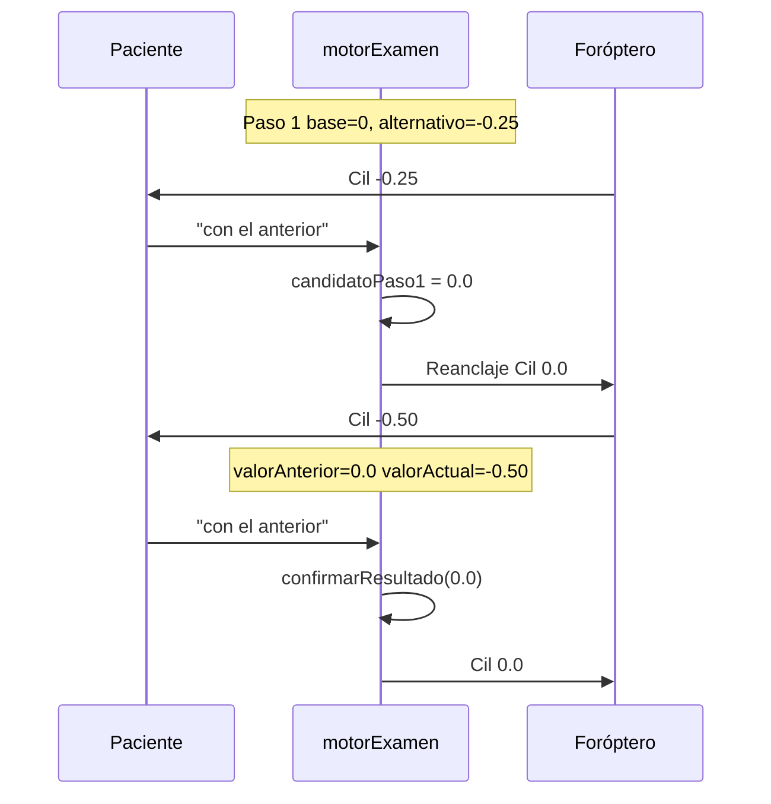

# Plan de implementación — Bugs binocular y cilíndrico (registro 13)

**Evidencia:** `registros-examen/examen-registro-13.csv` (2026-07-03 10:15–10:29)  
**Estado:** análisis y plan — **sin cambios de código aún**  
**Archivos principales afectados:** `reference/foroptero-server/motorExamen.js`  
**Referencias:** `DEFINICIONES_EXAMEN_BINOCULAR.md`, `PLAN_REANCLAJE_POST_COMPARATIVA_LENTES.md`, `PLAN_FEEDBACK_CLIENTE_EXAMEN.md` §2.6.3

---

## 0. Resumen ejecutivo

| # | Bug | Severidad | Causa raíz (1 línea) |
|---|-----|-----------|----------------------|
| **B1** | Sin posición inicial de comparación antes de cambiar lente (binocular) | Alta clínica / UX | La primera ronda esférica se ejecuta aunque la variante es **no-op**; no hay anclaje hardware explícito de `rxBasePaso` antes de `rxVariante` en cada ronda |
| **B2** | Al decir «con la anterior» en la última prueba binocular, el examen finaliza pero el foróptero no refleja el resultado | Alta clínica | `confirmarResultadoBinocular` persiste resultados y avanza a `FINALIZADO` **sin** comando foróptero con la Rx elegida |
| **B3** | Cilíndrico secuencial bajo paso 2: «con la anterior» elige −0,25 en vez de 0,0 | Alta clínica | Tras paso 1, `obtenerInstrucciones` asigna `valorAnterior = valorActual` (−0,25) en lugar de `candidatoPaso1` (0,0) |

**Resultado esperado del examen registro-13 (OD cilíndrico):** `Cilíndrico (R) = 0` (paciente prefirió 0,0 en paso 2). **Obtenido:** `−0,25` (línea 176 del CSV).

---

## 1. Análisis del registro — evidencia por bug

### Contexto del examen

| Campo | Valor |
|-------|-------|
| Valores iniciales | `<R> +0.25, -0.50, 175 / <L> +0.50, -1.50, 20` |
| Valores recalculados | `<R> +0.25, +0.00, 175 / <L> +0.50, -1.00, 20` |
| Resultado OD cilíndrico | **−0,25** (incorrecto si la intención clínica era 0,0) |
| Resultado binocular | `R: Esf +0.00 / Cil +0.00 @ 0° / L: Esf +0.00 / Cil −0.50 @ 20°` |

---

### B1 — Sin posición inicial antes de cambiar lente (binocular)

**Síntoma:** El paciente recibe la pregunta comparativa «¿anterior o actual?» sin haber tenido un cambio de lente perceptible que establezca qué es «actual».

**Evidencia en registro-13:**

| Timestamp | Línea CSV | Evento | Observación |
|-----------|-----------|--------|-------------|
| 10:26:12 | 156 | Foróptero baseline binocular: `R +0.00/+0.00`, `L +0.00/−1.00` | Línea base ETAPA_6 |
| 10:26:22 | 158 | «Avisame cuando estés listo» | Transición §2.3 DEFINICIONES |
| 10:27:48 | 159–160 | Paciente «listo»; foróptero **sin cambio** | Anclaje durante espera |
| 10:27:49 | 161–162 | TV + pregunta «¿anterior o actual?» | **Primera comparación esférica** |
| — | — | Entre 160 y 162 **no hay** línea Foróptero-TV con cambio de esfera | Ambas esferas ya eran 0 → variante esférica = no-op |
| 10:28:16 | 163–165 | «con la anterior»; foróptero igual | Respuesta sin contraste físico previo |
| 10:28:24 | 167 | **Primer cambio real** binocular: `L Cil −1.00 → −0.50` | Primera variante perceptible |

**Interpretación clínica:** La comparación esférica binocular fue **degenerada** (variante idéntica a la base). El paciente respondió «anterior/actual» sin que los lentes hubieran cambiado. La primera comparación con cambio físico fue la cilíndrica (~45 s después de «listo»).

**Comportamiento esperado (según definiciones):**

- §2.3: la fase «listo» establece la base inicial **solo para la primera ronda**.
- §12.2: cada ronda aplica variante y pregunta; «anterior» = `rxBasePaso` del paso.
- §7 / lógica no-op: si la variante esférica no mueve ningún ojo, **omitir** la ronda esférica y pasar directo a cilíndrico (análogo a `omitirCilindro` cuando ambos cil = 0).

---

### B2 — Binocular final «con la anterior»: resultado guardado pero foróptero no se mueve

**Síntoma:** Al cerrar la última comparación binocular con preferencia «anterior», el examen pasa a `FINALIZADO` pero el hardware sigue mostrando la **variante** que tenía el paciente en cara, no la Rx confirmada.

**Evidencia en registro-13:**

El registro-13 cierra la última ronda binocular con **«con la actual»** (líneas 170–171), por lo que foróptero y resultado coinciden (`L Cil −0.50`). **B2 no se manifiesta en este CSV concreto**, pero es reproducible por diseño cuando la última respuesta es «anterior»:

| Escenario | Rx en cara al responder | Rx confirmada (`rxActiva`) | Foróptero post-confirmación |
|-----------|-------------------------|----------------------------|-----------------------------|
| Última ronda, «con la **actual**» | `rxVariante` (ej. L −0,50) | `rxVariante` | ✅ Coincide (caso registro-13) |
| Última ronda, «con la **anterior**» | `rxVariante` (ej. L −0,50) | `rxBasePaso` (ej. L −1,00) | ❌ Sigue en −0,50 |

**Contraste con ETAPA_5:** `confirmarResultado` para `cilindrico` **sí** llama a `ejecutarComandoForopteroInterno` con el valor final (aprox. líneas 3357–3378 de `motorExamen.js`). `confirmarResultadoBinocular` **no** tiene equivalente.

**Evidencia indirecta en registro-13:**

| Timestamp | Línea | Evento |
|-----------|-------|--------|
| 10:28:36 | 170–171 | «con la actual» → examen termina |
| 10:28:36 | 172–185 | `etapa_actual = FINALIZADO`; último foróptero = variante L −0,50 |
| — | 185 | Resultado binocular L Cil −0,50 — coherente solo porque la respuesta fue «actual» |

---

### B3 — Cilíndrico secuencial bajo paso 2: «anterior» → −0,25 en vez de 0,0

**Síntoma:** En la segunda comparativa del modo `cilindricoSecuencialBajo` (par **C1 vs −0,50**), si el paciente elige «con la anterior» (esperando C1 = 0,0), el sistema confirma −0,25.

**Evidencia en registro-13 (OD, base cilíndrica 0,0 tras esférico fino):**

| Timestamp | Línea | Foróptero (OD) | Respuesta | Interpretación |
|-----------|-------|----------------|-----------|----------------|
| 10:18:08 | 48 | `Esf +0.00 / Cil +0.00` | Fin esférico fino | Base cilíndrico = 0 |
| 10:18:20 | 50 | `Cil −0.25` | — | **Paso 1:** 0 vs −0,25 (alternativo) |
| 10:18:41 | 53–55 | `Cil +0.00` | «con el anterior» | C1 = **0,0**; reanclaje correcto en hardware |
| 10:18:51 | 57 | `Cil −0.50` | — | **Paso 2:** debería ser 0,0 vs −0,50 |
| 10:19:02 | 60–62 | `Cil −0.25` | «con el anterior» | ❌ Fue a −0,25, no a 0,0 |
| — | 176 | Resultado `Cilíndrico (R) = −0.25` | — | Confirma el bug |

**Reconstrucción del estado interno erróneo en paso 2:**

```
Tras paso 1 («anterior» → C1 = 0,0):
  candidatoPaso1 = 0,0
  valorElegidoReanclaje = 0,0
  valorAMostrar (paso 2) = −0,50

obtenerInstrucciones (líneas 2030–2032) hace:
  caraAntesUpdate = valorActual = −0,25   ← lo que estaba en cara en paso 1
  valorAnterior   = valorActual = −0,25   ← BUG: debería ser candidatoPaso1 = 0,0
  valorActual     = −0,50

Al responder «anterior» en paso 2:
  elegirCandidato() → snapOtro = valorAnterior = −0,25   ← incorrecto
  confirmarResultado(−0,25)
```

**Lo que el foróptero hizo bien vs. lo que falló:**

| Capa | Paso 1 → 2 | Paso 2 respuesta |
|------|------------|------------------|
| **Hardware** | Reanclaje a Cil 0,0 (l. 55) → muestra −0,50 (l. 57) | Vuelve a −0,25 (l. 62) siguiendo lógica errónea |
| **Estado lógico** | `valorAnterior` no se actualiza a C1 | `snapOtro` = −0,25 en lugar de 0,0 |

**Especificación violada:** `PLAN_FEEDBACK_CLIENTE_EXAMEN.md` §2.6.3.2 — *«Inicio paso 2: comparativa C1 (referencia / valorAnterior) vs −0,50»*.

---

## 2. Causa raíz en código

### B1 — Binocular: ronda esférica no-op + sin anclaje pre-variante

**Ubicación:** `motorExamen.js`

| Función | Problema |
|---------|----------|
| `iniciarBinocular()` (~3690) | Siempre fija `paso: 'esfera'` y calcula `rxVariante = aplicarVarianteEsferica(rxBase)` aunque sea idéntica a la base |
| `generarPasosEtapa6()` (~3760–3769) | `FB_ESF_MOSTRAR` aplica `rxVariante` directamente; no detecta no-op ni salta a cilíndrico |
| `procesarRespuestaBinocular()` (~3865) | Solo omite cilíndrico si `ambosCilindrosCero`; no omite esférico no-op |
| `generarPasosEtapa6()` | No existe paso intermedio «solo `rxBasePaso` + pausa» antes de `rxVariante` (brecha documentada en `PLAN_REANCLAJE` §2.2) |

**Cadena causal:**

```
iniciarBinocular → rxVariante esférica === rxBase (ambas esferas = 0)
→ FB_ESF_MOSTRAR no mueve foróptero
→ MSG_BINOC_PREGUNTA_COMBINADA igualmente
→ Paciente responde sin contraste físico
→ Primera variante real recién en FB_CIL_MOSTRAR
```

---

### B2 — Binocular: confirmación sin movimiento de foróptero

**Ubicación:** `motorExamen.js`

| Función | Problema |
|---------|----------|
| `confirmarResultadoBinocular()` (~3887–3905) | Escribe `resultados.R/L.binocular`, resetea estado, `avanzarTest()` — **sin** `foropteroDesdeRx` ni `ejecutarComandoForopteroInterno` |
| `obtenerInstrucciones()` ETAPA_6 (~2137–2152) | Tras `resultadoConfirmado`, llama `generarPasos()` → etapa `FINALIZADO` (sin pasos de hardware) |

**Cadena causal (última ronda, preferencia «anterior»):**

```
procesarRespuestaBinocular (paso cilindro, anterior)
→ rxActiva = rxBasePaso (ej. L −1,00)
→ confirmarResultadoBinocular(rxActiva)  // persiste −1,00
→ foróptero sigue en rxVariante (L −0,50) mostrada durante la pregunta
→ avanzarTest() → FINALIZADO sin corrección
```

**Contraste:** `confirmarResultado()` para cilíndrico monocular sí actualiza foróptero de forma asíncrona (~3359–3378).

---

### B3 — Cilíndrico secuencial bajo: `valorAnterior` incorrecto al entrar en paso 2

**Ubicación:** `motorExamen.js` — bloque genérico ETAPA_5 `necesitaMostrarLente` (~2026–2033)

```javascript
const caraAntesUpdate = estado.valorActual;
estado.valorAnterior = estado.valorActual;  // ← BUG para paso 2 secuencial bajo
estado.valorActual = resultado.valorAMostrar;
```

**Problema:** La regla genérica asume que «anterior» en la siguiente comparativa es lo que estaba en cara (`valorActual`). En `cilindricoSecuencialBajo` paso 2, la referencia es **`candidatoPaso1`** (o `valorElegidoReanclaje`), no el alternativo del paso 1.

**Función afectada downstream:** `procesarRespuestaCilindricoSecuencialBajo()` (~3119–3124) usa `snapOtro = estado.valorAnterior` en `elegirCandidato()`.

**Por qué el reanclaje hardware no salva la lógica:** `valorElegidoReanclaje` se usa solo para `pasosReanchor` (foróptero), pero **no** para actualizar `valorAnterior` en el estado de comparación.

---

## 3. Plan de implementación

### Orden sugerido

| Orden | Bug | Motivo |
|-------|-----|--------|
| 1 | **B3** | Fix acotado, alta certeza, evidencia directa en registro-13 |
| 2 | **B2** | Fix acotado, paridad con `confirmarResultado` ETAPA_5 |
| 3 | **B1** | Requiere decisión de producto sobre skip no-op esférico vs. anclaje explícito |

---

### Fase 1 — B3: `valorAnterior` en cilíndrico secuencial bajo paso 2

**Archivo:** `reference/foroptero-server/motorExamen.js`

**Tarea 1.1 — Corregir actualización de estado al pasar a paso 2**

En el bloque `if (resultado.necesitaMostrarLente)` de ETAPA_5 (~2026), **antes** de asignar `valorAnterior`:

```
SI estado.cilindricoSecuencialBajo && estado.pasoSecuencialBajo === 2:
  estado.valorAnterior = estado.candidatoPaso1
  // (alternativa equivalente: resultado.valorElegidoReanclaje del paso 1)
SINO:
  estado.valorAnterior = caraAntesUpdate  // regla actual
estado.valorActual = resultado.valorAMostrar
```

**Tarea 1.2 — Test / QA manual**

| Caso | Base | Paso 1 | Paso 2 | Respuesta paso 2 | Resultado esperado |
|------|------|--------|--------|------------------|-------------------|
| A | 0 | «anterior» (→ 0) | 0 vs −0,50 | «anterior» | Cil = **0,0** |
| B | 0 | «actual» (→ −0,25) | −0,25 vs −0,50 | «anterior» | Cil = **−0,25** |
| C | −0,25 | «anterior» (→ 0) | 0 vs −0,50 | «anterior» | Cil = **0,0** |
| D | 0 | paso 1 «anterior» | paso 2 | «igual» | Cil = valor más cercano a 0 entre 0 y −0,50 → **0,0** |

**Evidencia objetivo:** repetir tramo OD cilíndrico de registro-13; exportar `examen-registro-14.csv`; verificar `Cilíndrico (R) = 0` y foróptero final `Cil +0.00`.

**Riesgo de regresión:** Bajo — cambio acotado a rama `cilindricoSecuencialBajo` paso 2; cilíndrico bilateral normal no usa este path.

---

### Fase 2 — B2: foróptero al confirmar binocular

**Archivo:** `reference/foroptero-server/motorExamen.js`

**Tarea 2.1 — Aplicar Rx final en `confirmarResultadoBinocular`**

Opción recomendada (paridad ETAPA_5):

```
function confirmarResultadoBinocular(rxFinal) {
  const n = normalizarRxPar(copiarRxPar(rxFinal));
  // ... persistir resultados ...
  if (ejecutarComandoForopteroInterno) {
    await/ejecutar foropteroDesdeRx(n)  // ambos ojos open
  }
  // ... avanzarTest ...
}
```

Considerar `esperar_foroptero` si el contrato del examen requiere ready antes de `FINALIZADO` (evaluar vs. patrón async de cilíndrico monocular).

**Tarea 2.2 — Caso preferencia «anterior» en última ronda**

Tras fix, al responder «anterior» en `FB_CIL_PREG`:

1. `rxActiva = rxBasePaso`
2. Foróptero se mueve a `rxBasePaso`
3. Resultado CSV = `rxBasePaso`

**Tarea 2.3 — QA manual**

| Caso | Última respuesta | Foróptero post-examen | `resultados.*.binocular` |
|------|------------------|----------------------|--------------------------|
| A | «con la actual» | = variante | = variante |
| B | «con la anterior» | = base del paso cilíndrico | = base del paso cilíndrico |
| C | «igual» (→ anterior) | = base | = base |

**Evidencia:** CSV con caso B explícito (registro-13 no lo cubre; hay que forzar respuesta «anterior» en ronda cilíndrica final).

---

### Fase 3 — B1: posición inicial binocular antes de cambiar lente

**Archivos:** `motorExamen.js`, opcionalmente `DEFINICIONES_EXAMEN_BINOCULAR.md`

**Decisión de producto requerida (D-B1):**

| Opción | Descripción | Pros | Contras |
|--------|-------------|------|---------|
| **A (recomendada)** | **Omitir ronda esférica** si `rxVariante` esférica es igual a `rxBasePaso` (no-op en ambos ojos) | Elimina pregunta sin sentido; alinea con §7 (omitir cil cuando ambos 0) | Hay que definir mensaje al paciente (¿silencioso o frase breve?) |
| **B** | Insertar paso explícito: foróptero en `rxBasePaso` → pausa → variante → pregunta **en cada ronda** | Anclaje hardware claro | Más latencia; desvía de §12.2 actual |
| **C** | Solo omitir pregunta si no-op; si hay cambio esférico en un ojo, mantener flujo actual | Mínimo cambio | No resuelve anclaje explícito pre-variante en rondas con cambio |

**Tarea 3.1 — Implementar opción A**

1. Función `rxEsfericaVarianteEsNoOp(rxBase, rxVariante)` — comparar esferas R y L.
2. En `iniciarBinocular()` o al procesar `FB_TRANS_LISTO → FB_ESF_MOSTRAR`:
   - Si no-op: saltar a lógica equivalente a post-respuesta esférica «anterior» (`rxActiva = rxBase`, calcular variante cilíndrica, `paso = 'cilindro'`, `FB_CIL_MOSTRAR` o `confirmarResultadoBinocular` si también omitir cil).
3. Si `ambosCilindrosCero` tras skip esférico → confirmar directo.

**Tarea 3.2 — Registro / telemetría**

Exponer en `contexto.binocularEstado` flag `esferaOmitidaNoOp: true` para depuración y CSV.

**Tarea 3.3 — QA con registro-13 equivalente**

Verificar secuencia:

```
listo → (sin pregunta esférica) → variante cilíndrica L −0,50 → pregunta anterior/actual
```

**Evidencia:** CSV donde entre «listo» y primera pregunta comparativa haya **exactamente un** cambio de foróptero (cilíndrico), no cero.

---

## 4. Matriz de archivos a tocar

| Archivo | B3 | B2 | B1 |
|---------|----|----|-----|
| `reference/foroptero-server/motorExamen.js` | ✅ | ✅ | ✅ |
| `DEFINICIONES_EXAMEN_BINOCULAR.md` | — | — | Opcional (§7 u §12: skip esférico no-op) |
| `DOCUMENTACION.md` | ✅ | ✅ | ✅ |
| `src/app/agentConfigs/chatSupervisor/index.ts` | — | — | Probablemente sin cambios (mensajes vienen del backend) |

**Sin cambios previstos:** agente, server.js, firmware foróptero.

---

## 5. Checklist de QA integrado (post-implementación)

Exportar `registros-examen/examen-registro-14.csv` (o siguiente número) con examen completo OD + OI + binocular.

| # | Verificación | Bug |
|---|--------------|-----|
| 1 | OD cilíndrico base 0: paso 2 «anterior» → Cil **0,0** en resultados y foróptero | B3 |
| 2 | Binocular última ronda «anterior» → foróptero = resultado guardado al `FINALIZADO` | B2 |
| 3 | Binocular con ambas esferas 0: tras «listo», **no** pregunta esférica; primera pregunta tras cambio cilíndrico | B1 |
| 4 | Binocular con esfera ≠ 0 en al menos un ojo: ronda esférica sigue funcionando | B1 regresión |
| 5 | Cilíndrico bilateral normal (base ≤ −0,50) sin regresión | B3 regresión |
| 6 | `postComparacionContinuar` / Sigamos entre comparativas intra-test intacto | Regresión |

---

## 6. Diagrama de flujo — B3 (estado corregido)



---

## 7. Referencias cruzadas

| Documento | Relación |
|-----------|----------|
| `registros-examen/examen-registro-13.csv` | Evidencia primary (B1, B3 directos; B2 por diseño) |
| `PLAN_FEEDBACK_CLIENTE_EXAMEN.md` §2.6.3.1–2 | Especificación cilíndrico secuencial bajo |
| `PLAN_REANCLAJE_POST_COMPARATIVA_LENTES.md` §2.2, §4 | Brecha anclaje binocular pre-variante |
| `DEFINICIONES_EXAMEN_BINOCULAR.md` §2.3, §7, §12 | Transición listo; omisión pasos; orden operativo |
| `reference/foroptero-server/motorExamen.js` | ~2026–2033 (B3), ~3887 (B2), ~3690–3878 (B1) |

---

*Documento generado a partir del análisis de registro-13. No incluye cambios de código — solo diagnóstico y plan de implementación.*
