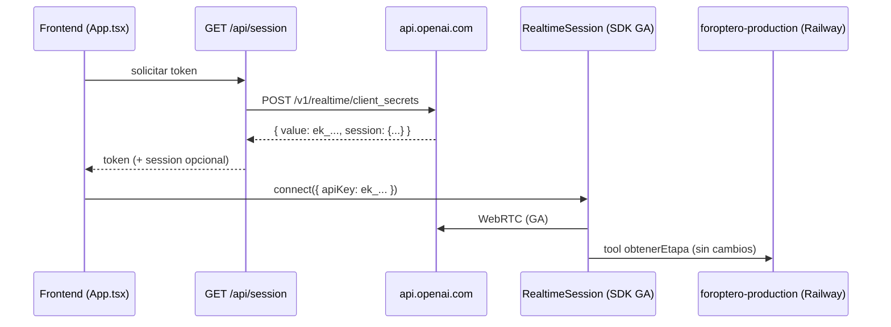

# Plan de implementación — Migración Realtime API Beta → GA

**Versión:** 0.2  
**Fecha:** 2026-05-18  
**Estado:** Implementado (pendiente verificación manual Connect + E2E Railway)  
**Proyecto:** `openai-realtime-agents-main-2` (frontend Oftalmólogo AI)  
**Relacionado con:** error `beta_api_shape_disabled`, síntoma `error.no_ephemeral_key`  
**Referencia externa:** migración ya aplicada en proyecto hermano (plan v0.3, 2026-05-15)

---

## Tabla de contenidos

1. [Resumen ejecutivo](#1-resumen-ejecutivo)
2. [Problema y causa raíz](#2-problema-y-causa-raíz)
3. [Viabilidad en este repositorio](#3-viabilidad-en-este-repositorio)
4. [Diferencias respecto al otro proyecto](#4-diferencias-respecto-al-otro-proyecto)
5. [Alcance](#5-alcance)
6. [Decisiones recomendadas](#6-decisiones-recomendadas)
7. [Arquitectura objetivo](#7-arquitectura-objetivo)
8. [Inventario de cambios por archivo](#8-inventario-de-cambios-por-archivo)
9. [Mapa Beta → GA](#9-mapa-beta--ga)
10. [Fases de implementación](#10-fases-de-implementación)
11. [PRs sugeridos](#11-prs-sugeridos)
12. [Criterios de aceptación y pruebas](#12-criterios-de-aceptación-y-pruebas)
13. [Riesgos y mitigaciones](#13-riesgos-y-mitigaciones)
14. [Referencias](#14-referencias)

---

## 1. Resumen ejecutivo

El frontend **no puede conectar** a OpenAI Realtime porque el stack actual usa la **interfaz beta** de la API, **deshabilitada por OpenAI** (código `beta_api_shape_disabled`, mensaje: *"The Realtime Beta API is no longer supported. Please use /v1/realtime for the GA API."*).

El síntoma visible en el panel **Logs** (`error.no_ephemeral_key`) es **secundario**: `GET /api/session` llama a `POST /v1/realtime/sessions`, OpenAI rechaza la petición, y `App.tsx` no encuentra `client_secret.value`.

**Análisis de viabilidad:** este repositorio es **estructuralmente idéntico** al demo [openai-realtime-agents](https://github.com/openai/openai-realtime-agents) y al proyecto donde ya se migró. Los mismos archivos críticos existen con el **mismo contrato beta**. La solución del otro proyecto **aplica directamente** con ajustes menores en pruebas E2E (URL del backend, nombre de tool).

La migración requiere **tres capas**:

| Capa | Acción principal |
|------|------------------|
| **Backend (Next.js)** | Reemplazar `POST /v1/realtime/sessions` por `POST /v1/realtime/client_secrets` con forma de sesión GA |
| **Dependencias** | Actualizar `@openai/agents` de **0.0.5** a **≥ 0.1.0** (recomendado **0.11.x**); posible salto a **Zod v4** y **openai v6** |
| **Frontend (runtime)** | Adaptar lectura del token, eventos de transcript y `session.update` (VAD / PTT) al contrato GA |

El **backend clínico** (`reference/foroptero-server/`, Railway `foroptero-production`) y la tool `obtenerEtapa` **no requieren cambios** para restaurar Connect; solo hay que validar CORS y el flujo de examen tras la migración.

**Esfuerzo orientativo:** 1–2 días de desarrollo + pruebas manuales Connect + E2E con Railway.

---

## 2. Problema y causa raíz

### 2.1 Síntoma (confirmado en este repo)

Al pulsar **Connect** (o al auto-conectar al cargar `chatSupervisor`):

1. `fetch_session_token_request`
2. `fetch_session_token_response` con JSON de error OpenAI
3. `error.no_ephemeral_key` (rojo)

```json
{
  "error": {
    "message": "The Realtime Beta API is no longer supported. Please use /v1/realtime for the GA API.",
    "type": "invalid_request_error",
    "code": "beta_api_shape_disabled"
  }
}
```

### 2.2 Cadena causal (estado actual del código)

```
App.tsx (connectToRealtime / fetchEphemeralKey)
  → GET /api/session
    → POST https://api.openai.com/v1/realtime/sessions   [contrato beta]
      → OpenAI: beta_api_shape_disabled
    → NextResponse.json(data) con status 200 implícito
  → App.tsx: !data.client_secret?.value → error.no_ephemeral_key
  → (nunca llega RealtimeSession.connect)
```

**Evidencia en código:**

- `src/app/api/session/route.ts` — línea 6: URL `.../v1/realtime/sessions`, body `{ model }` únicamente.
- `src/app/App.tsx` — líneas 187–194: lectura de `data.client_secret?.value`.
- `package.json` — `"@openai/agents": "^0.0.5"`.

### 2.3 Causa raíz

Integración basada en el demo oficial anterior a la migración GA del SDK (changelog **0.1.0**: *"moving realtime to the new GA API"*). OpenAI deshabilitó la forma beta a partir del **12 de mayo de 2026**.

---

## 3. Viabilidad en este repositorio

| Aspecto | Este repo | Proyecto ya migrado | ¿Aplica la misma solución? |
|---------|-----------|---------------------|----------------------------|
| Endpoint token | `POST /v1/realtime/sessions` | → `client_secrets` | **Sí** |
| Lectura token | `client_secret.value` | → `value` (`ek_…`) | **Sí** |
| SDK | `@openai/agents@0.0.5` | → `0.11.x` | **Sí** |
| `session.update` VAD | `session.turn_detection` (beta) | → `session.audio.input.turn_detection` | **Sí** |
| Eventos transcript asistente | `response.audio_transcript.*` | → `response.output_audio_transcript.*` | **Sí** |
| Config SDK | `inputAudioTranscription` | → forma GA en `config` / servidor | **Sí** |
| Agente principal | `chatSupervisor` / `obtenerEtapa` | `consultarExamen` + otro host | **Sin cambio de migración** |
| Guardrails | `/api/responses` + Zod 3 | Zod 4 + openai 6 | **Revisar en Fase 2** |
| Escenarios demo | `customerServiceRetail`, `simpleHandoff` | N/A o distinto | **Misma migración técnica** |

**Conclusión:** la migración del otro proyecto es **reutilizable al ~95%**. El 5% restante son pruebas E2E y documentación de URLs/tools propias de este PoC.

---

## 4. Diferencias respecto al otro proyecto

Estos puntos **no cambian** el plan técnico Beta→GA, pero **sí** el checklist de pruebas y decisiones de despliegue:

| Tema | Otro proyecto (v0.3) | **Este repositorio** |
|------|----------------------|---------------------|
| Tool principal | `consultarExamen` | **`obtenerEtapa`** |
| URL backend examen | `NEXT_PUBLIC_FOROPTERO_ORCHESTRATOR_URL` → oftalmagentv2 | **Hardcoded** en `chatSupervisor/index.ts`: `https://foroptero-production.up.railway.app/api/examen/instrucciones` |
| Orquestador intermedio | `reference/foroptero-orchestrator/` | **No presente**; lógica en Railway + `reference/foroptero-server/` (referencia local) |
| Escenario por defecto | chatSupervisor oftalmólogo | **`defaultAgentSetKey = 'chatSupervisor'`** (igual) |
| UI branding | Oftalmólogo AI | Igual (`App.tsx` título "Oftalmólogo AI") |
| Documentación sistema | `DISENO_AGENTE_INTERMEDIO.md` | **`DOCUMENTACION.md`**, `README.md` |

**Recomendación opcional (fuera del mínimo GA):** extraer la URL del backend a `NEXT_PUBLIC_FOROPTERO_API_URL` para alinear con el otro proyecto; **no es obligatorio** para resolver `beta_api_shape_disabled`.

---

## 5. Alcance

### 5.1 Incluido

| Componente | Cambio |
|------------|--------|
| `src/app/api/session/route.ts` | Endpoint y body GA para `client_secrets`; propagar HTTP status |
| `src/app/App.tsx` | Token `data.value`, errores `data.error`, `session.update` GA |
| `src/app/hooks/useRealtimeSession.ts` | Config transcripción GA; eventos `output_audio_transcript` |
| `package.json` / `package-lock.json` | Upgrade `@openai/agents`, Zod, `openai` |
| Pruebas manuales | Connect, voz, PTT, tool `obtenerEtapa`, guardrail |
| `README.md` | Nota breve: requiere Realtime GA + versiones mínimas SDK |
| Este documento | Actualizar **Estado** al cerrar fases |

### 5.2 Excluido

| Componente | Motivo |
|------------|--------|
| `reference/foroptero-server/*` | No usa Realtime; HTTP/MQTT independiente |
| `src/app/agentConfigs/guardrails.ts` (lógica) | Usa Responses API; solo posible ajuste Zod 4 |
| `src/app/agentConfigs/chatSupervisor/index.ts` (prompt/tool) | Sin cambios para GA; URL ya apunta a Railway |
| Cambios de protocolo clínico / prompts | Fuera del alcance técnico de la migración |
| Migración a `gpt-realtime-2` / reasoning | Opcional post-GA |

---

## 6. Decisiones (acordadas 2026-05-18)

Implementación según D1–D10 confirmadas por el equipo:

| ID | Decisión | Valor recomendado |
|----|----------|-------------------|
| **D1** | Modelo Realtime | **`gpt-realtime-mini-2025-12-15`** (ya en `session/route.ts` y `useRealtimeSession`) |
| **D2** | SDK | **`@openai/agents@^0.11.4`** |
| **D3** | Zod | **v4** junto con SDK ≥ 0.4 |
| **D4** | Arquitectura sesión | **Híbrido (C)** — token en servidor Next.js; agente/tools en SDK (como hoy) |
| **D5** | Voz | **`alloy`** (`RealtimeAgent.voice` en `chatSupervisor/index.ts`) |
| **D6** | VAD | **`server_vad`** — `threshold: 0.9`, `silence_duration_ms: 500` (como `App.tsx` actual) |
| **D7** | Expiración token | **600 s** (`expires_after.seconds`) |
| **D8** | Errores en UI | **Solo logs** (panel Events); sin toast nuevo |
| **D9** | `OpenAI-Safety-Identifier` | **No implementar** (no existe en el repo) |
| **D10** | E2E clínico | **`https://foroptero-production.up.railway.app`** — endpoint `POST /api/examen/instrucciones` |

### 6.1 D2–D3: por qué 0.11.x + Zod 4

- **`@openai/agents@0.0.5`** solo habla contrato **beta** en WebRTC y eventos.
- Desde **0.1.0** el paquete usa API **GA**.
- SDK **≥ 0.4** declara peer **Zod 4**; hoy el repo tiene **Zod 3.24** y `zodTextFormat` en `guardrails.ts`.
- Impacto clínico de `obtenerEtapa`: **ninguno** si el build pasa y Connect funciona.

**Alternativa no recomendada:** SDK 0.3.x + Zod 3 — menos deuda en guardrails, más deuda GA.

### 6.2 D4: reparto de configuración (sin cambio de negocio)

| Qué | Dónde hoy | Después de migrar |
|-----|-----------|-------------------|
| Modelo | `session/route.ts` + `useRealtimeSession` | Servidor GA en `client_secrets`; SDK puede duplicar `model` |
| Instrucciones oftalmólogo | `chatSupervisor/index.ts` | Igual — SDK |
| Tool `obtenerEtapa` | `chatSupervisor/index.ts` | Igual — SDK |
| Voz `alloy` | `RealtimeAgent.voice` | Igual; opcional en `session.audio.output.voice` |
| VAD / PTT | `App.tsx` → `session.update` | Misma lógica; JSON bajo `audio.input.turn_detection` |
| Transcripción entrada | `useRealtimeSession` `inputAudioTranscription` | Alinear con SDK GA / servidor |

---

## 7. Arquitectura objetivo

### 7.1 Flujo de autenticación y conexión (GA)



### 7.2 Separación de responsabilidades

| Rol | Componente | Protocolo |
|-----|------------|-----------|
| Agente de voz | `chatSupervisor` + SDK Realtime | WebRTC + eventos GA |
| Lógica examen + dispositivos | Railway `foroptero-production` | `POST /api/examen/instrucciones` |
| Referencia local | `reference/foroptero-server/` | Desarrollo / documentación |

---

## 8. Inventario de cambios por archivo

### 8.1 Crítico — bloquea Connect

#### `src/app/api/session/route.ts`

| Actual (beta) | Objetivo (GA) |
|---------------|---------------|
| `POST …/v1/realtime/sessions` | `POST …/v1/realtime/client_secrets` |
| Body: `{ model }` | Body con `expires_after` + `session: { type: "realtime", model, audio, … }` |
| Siempre `NextResponse.json(data)` | `NextResponse.json(data, { status: response.status })` |
| Sin validación de error | No devolver 200 cuando OpenAI devuelve `{ error }` |

**Ejemplo de body GA** (valores según D1, D5–D7):

```json
{
  "expires_after": {
    "anchor": "created_at",
    "seconds": 600
  },
  "session": {
    "type": "realtime",
    "model": "gpt-realtime-mini-2025-12-15",
    "output_modalities": ["audio"],
    "audio": {
      "input": {
        "transcription": { "model": "gpt-4o-mini-transcribe" },
        "turn_detection": {
          "type": "server_vad",
          "threshold": 0.9,
          "prefix_padding_ms": 300,
          "silence_duration_ms": 500,
          "create_response": true
        }
      },
      "output": { "voice": "alloy" }
    }
  }
}
```

#### `src/app/App.tsx` — `fetchEphemeralKey`

| Actual (líneas 187–194) | Objetivo |
|-------------------------|----------|
| `data.client_secret?.value` | `data.value` (prefijo `ek_`) |
| Log genérico `error.no_ephemeral_key` | Si `data.error`, loguear `code` + `message` |
| No usa `tokenResponse.ok` | Comprobar status HTTP antes de parsear |

#### `src/app/App.tsx` — `updateSession` (líneas 259–278)

| Actual (beta) | Objetivo (GA) |
|---------------|---------------|
| `session: { turn_detection: turnDetection }` | `session: { audio: { input: { turn_detection: turnDetection } } }` |

Comportamiento PTT/VAD **sin cambio funcional**:

| Modo UI | `turn_detection` |
|---------|------------------|
| VAD (PTT desactivado) | `server_vad` + `create_response: true` |
| PTT ("Hablar" activo) | `null` |

### 8.2 Alto — runtime voz

#### `package.json`

```json
"@openai/agents": "^0.11.4",
"zod": "^4",
"openai": "^6.37.0"
```

Ejecutar `npm install` y `npm run build`. Revisar breaking changes en [CHANGELOG agents-realtime](https://github.com/openai/openai-agents-js/blob/main/packages/agents-realtime/CHANGELOG.md).

#### `src/app/hooks/useRealtimeSession.ts`

| Área | Líneas / estado actual | Acción |
|------|------------------------|--------|
| Eventos asistente | 53–59: `response.audio_transcript.delta` / `.done` | Renombrar a `response.output_audio_transcript.delta` / `.done` |
| Transcripción usuario | 49: `conversation.item.input_audio_transcription.completed` | Verificar nombre en GA; mantener handler si sigue igual |
| `config.inputAudioTranscription` | 138–141 | Alinear con API del SDK 0.11 (p. ej. anidado bajo `audio.input`) |
| `RealtimeSession` / codec | `changePeerConnection` + `codecUtils` | Regresión manual con `?codec=` |

### 8.3 Bajo — revisión post-migración

| Archivo | Acción |
|---------|--------|
| `src/app/agentConfigs/chatSupervisor/index.ts` | Sin cambios GA; confirmar que `voice: 'alloy'` no conflictúa con sesión servidor |
| `src/app/agentConfigs/guardrails.ts` + `src/app/types.ts` | Ajustar imports Zod 4 / `zodTextFormat` si falla build |
| `src/app/hooks/useHandleSessionHistory.ts` | Probar transcript vía `history_*` del SDK |
| `src/app/lib/codecUtils.ts` | Regresión `?codec=opus|pcmu|pcma` |
| `src/app/agentConfigs/customerServiceRetail/*`, `simpleHandoff.ts` | Smoke test Connect si se usan escenarios demo |
| `README.md` (línea ~207 diagrama) | Actualizar `POST /v1/realtime/sessions` → `client_secrets` |
| `DOCUMENTACION.md` | Opcional: nota de requisito GA |

### 8.4 Sin cambios para migración GA

| Archivo | Motivo |
|---------|--------|
| `src/app/api/responses/route.ts` | Responses API, no Realtime |
| `src/app/api/health/route.ts` | Health check |
| Tool `obtenerEtapa` execute | HTTP a Railway independiente de Realtime |

---

## 9. Mapa Beta → GA

| Concepto | Beta (actual en este repo) | GA (objetivo) |
|----------|----------------------------|---------------|
| Endpoint token | `POST /v1/realtime/sessions` | `POST /v1/realtime/client_secrets` |
| Token en respuesta | `client_secret.value` | `value` (`ek_…`) |
| Header beta | Implícito en contrato antiguo | **No** usar `OpenAI-Beta: realtime=v1` |
| Modalidades salida | `modalities` | `output_modalities` |
| VAD / transcripción | campos planos en `session` | `session.audio.input.*` |
| Voz | `RealtimeAgent.voice` | `session.audio.output.voice` (servidor) + agente |
| Tipo sesión | implícito | `session.type: "realtime"` obligatorio |
| Transcript asistente | `response.audio_transcript.*` | `response.output_audio_transcript.*` |
| SDK mínimo | `@openai/agents@0.0.5` | `@openai/agents@≥0.1.0` (recom. 0.11.x) |

---

## 10. Fases de implementación

### Fase 0 — Preparación

**Entregables**

- [ ] Cerrar decisiones §6 (o aceptar recomendaciones).
- [ ] Verificar `OPENAI_API_KEY` con acceso Realtime GA.
- [ ] Confirmar Railway `foroptero-production` accesible y CORS para origen del frontend.
- [ ] Guardar baseline de logs (captura actual `beta_api_shape_disabled`).

**Verificación post-Fase 1:**

```bash
curl -s http://localhost:3000/api/session | jq .
# Esperado: "value": "ek_..."
```

---

### Fase 1 — Token efímero (backend + lectura cliente)

**Objetivo:** `/api/session` devuelve `value` válido.

**Tareas**

1. Modificar `src/app/api/session/route.ts` (§8.1).
2. Actualizar `fetchEphemeralKey` en `App.tsx`.
3. Propagar status HTTP de OpenAI.

**Criterio de salida:** `curl /api/session` → `"value": "ek_..."`; logs sin `beta_api_shape_disabled`.

> **Nota:** Con SDK 0.0.5, WebRTC puede seguir fallando hasta Fase 2.

---

### Fase 2 — Upgrade SDK y dependencias

**Objetivo:** Cliente compatible con API y eventos GA.

**Tareas**

1. Actualizar `package.json` según D2–D3.
2. `npm install` + `npm run build`.
3. Corregir tipos/imports `@openai/agents/realtime`.
4. Ajustar `guardrails.ts` / `types.ts` si Zod 4 rompe `zodTextFormat` o `.parse`.

**Criterio de salida:** `npm run build` sin errores; `npm run dev` arranca.

---

### Fase 3 — Runtime frontend (eventos y sesión)

**Objetivo:** Audio, transcript, PTT y `session.update` operativos.

**Tareas**

1. `useRealtimeSession.ts` — eventos y config (§8.2).
2. `App.tsx` — `updateSession` forma GA (§8.1).
3. Probar mensaje simulado `conversation.item.create` + `response.create`.
4. Regresión codec `?codec=`.

**Criterio de salida:** Connect → CONNECTED; audio del agente; transcript usuario y asistente en panel Conversación.

---

### Fase 4 — Integración clínica (este PoC)

**Objetivo:** Flujo oftalmológico intacto.

**Tareas**

1. Connect con `agentConfig=chatSupervisor` (default).
2. Verificar llamada inicial `obtenerEtapa` en logs / breadcrumb "function call".
3. Confirmar `POST` a `https://foroptero-production.up.railway.app/api/examen/instrucciones`.
4. Al menos un turno con `pasos[].mensaje` pronunciado según backend.

**Criterio de salida:** Backend responde 200; agente lee mensajes del backend textualmente.

---

### Fase 5 — Cierre y documentación

**Tareas**

1. Checklist §12 completo.
2. Actualizar **Estado** de este documento a *Implementado*.
3. Nota en `README.md` (GA + versiones SDK).

---

## 11. PRs sugeridos

| PR | Contenido | Depende de |
|----|-----------|------------|
| **PR1** | Fase 1 — `session/route.ts` + `fetchEphemeralKey` | Fase 0 |
| **PR2** | Fase 2 — dependencias, build, guardrails/Zod | PR1 |
| **PR3** | Fase 3 — `useRealtimeSession`, `updateSession` | PR2 |
| **PR4** | Fase 4–5 — E2E, README, estado doc | PR3 |

**Mínimo viable:** PR1 + PR2 + PR3 en un solo branch si se prefiere un único merge.

---

## 12. Criterios de aceptación y pruebas

### 12.1 Checklist funcional

| # | Prueba | Pasos | Éxito |
|---|--------|-------|-------|
| T1 | Token | `curl /api/session` o Connect | `value` con prefijo `ek_`; sin `beta_api_shape_disabled` |
| T2 | Conexión | Connect / auto-connect | CONNECTED; sin `error.no_ephemeral_key` |
| T3 | Saludo | Tras connect + `sendSimulatedUserMessage('hi')` | Audio del agente |
| T4 | Transcript usuario | Hablar al micrófono | Texto en panel Conversación |
| T5 | Transcript asistente | Respuesta del agente | Texto actualizado (eventos GA) |
| T6 | Tool | Inicio sesión chatSupervisor | `obtenerEtapa` en logs; HTTP 200 a Railway |
| T7 | PTT | Activar "Hablar", pulsar, hablar, soltar | Una respuesta por turno |
| T8 | VAD toggle | Desactivar PTT | VAD al final del habla |
| T9 | Codec | `?codec=pcmu` + reload + Connect | Conexión estable |
| T10 | Guardrail | Respuesta que dispare moderación | Chip / breadcrumb guardrail |
| T11 | E2E examen | Flujo con backend Railway | Al menos un `hablar` desde `pasos[]` |

### 12.2 Entornos

| Entorno | Frontend | Backend examen |
|---------|----------|----------------|
| Local dev | `npm run dev` (:3000) | `https://foroptero-production.up.railway.app` |
| Producción | Despliegue Next.js | Misma URL (hoy hardcoded en tool) |

---

## 13. Riesgos y mitigaciones

| Riesgo | Prob. | Impacto | Mitigación |
|--------|-------|---------|------------|
| Zod 3 → 4 rompe guardrails | Media | Alto | Probar T10; revisar `zodTextFormat` |
| Eventos renombrados → transcript vacío | Media | Medio | §9; T4–T5 antes de T11 |
| Solo PR1 sin PR2 → Connect parcial | Alta | Alto | No cerrar sin Fase 2 |
| URL backend hardcoded vs entorno | Media | Medio | T6/T11 contra Railway; opcional env var |
| CORS Railway bloquea tool desde otro origen | Baja | Alto | Verificar headers en despliegue frontend |
| Duplicar VAD voz servidor + SDK | Media | Bajo | Preferir servidor en `client_secrets`; PTT sigue vía `session.update` |

---

## 14. Referencias

| Recurso | URL |
|---------|-----|
| Migración Beta → GA | https://developers.openai.com/api/docs/guides/realtime#beta-to-ga-migration |
| Create client secret | https://developers.openai.com/api/docs/api-reference/realtime-sessions/create-realtime-client-secret |
| Voice agents | https://developers.openai.com/api/docs/guides/voice-agents |
| Changelog deprecación (12-may-2026) | https://developers.openai.com/api/docs/changelog |
| SDK agents-realtime CHANGELOG | https://github.com/openai/openai-agents-js/blob/main/packages/agents-realtime/CHANGELOG.md |
| Demo origen (beta) | https://github.com/openai/openai-realtime-agents |
| Documentación PoC local | [DOCUMENTACION.md](./DOCUMENTACION.md) |
| Plan migración proyecto hermano | (interno) v0.3 implementado 2026-05-15 |

---

## Historial de revisiones

| Versión | Fecha | Cambios |
|---------|-------|---------|
| 0.1 | 2026-05-18 | Análisis de viabilidad; inventario adaptado a `openai-realtime-agents-main-2`; sin cambios de código |

### Registro de implementación (v0.2)

| Archivo | Cambio |
|---------|--------|
| `package.json` | `@openai/agents@^0.11.4`, `zod@^4`, `openai@^6.37.0` |
| `src/app/api/session/route.ts` | `POST /v1/realtime/client_secrets`, sesión GA, status HTTP propagado |
| `src/app/App.tsx` | Token `data.value`, errores `data.error`, `session.update` con `audio.input` |
| `src/app/hooks/useRealtimeSession.ts` | Config `audio.input.transcription`, eventos `response.output_audio_transcript.*` |

| Versión | Fecha | Cambios |
|---------|-------|---------|
| 0.2 | 2026-05-18 | Implementación D1–D10; build OK |
